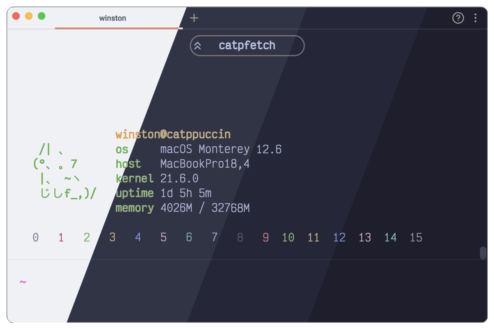

<h3 align="center">
	<br/>
	
	Catppuccin for <a href="https://github.com/catppuccin/template">Warp</a>
	
</h3>

<p align="center">
	<a href="https://github.com/catppuccin/warp/stargazers"></a>
	<a href="https://github.com/catppuccin/warp/issues"></a>
	<a href="https://github.com/catppuccin/warp/contributors"></a>
</p>

<p align="center">
	
</p>

## Previews

<details>
<summary>🌻 Latte</summary>

</details>
<details>
<summary>🪴 Frappé</summary>

</details>
<details>
<summary>🌺 Macchiato</summary>

</details>
<details>
<summary>🌿 Mocha</summary>

</details>

## Usage

1. Move the files in `./dist/` to you `~/.warp/themes`, or download them with `curl`:
```bash
mkdir -p ~/.warp/themes/
curl --output-dir ~/.warp/themes -LO https://raw.githubusercontent.com/catppuccin/warp/main/dist/catppuccin_{latte,frappe,macchiat,mocha}.yml
```
2. Open the "Theme Picker" either from your command paltte or by pressing <kbd>⌃⌘T</kbd>
3. Select your preferred Catppuccin flavour

## 💝 Thanks to

- [winston](https://github.com/nekowinston)

&nbsp;

<p align="center">
	
</p>

<p align="center">
	Copyright &copy; 2021-present <a href="https://github.com/catppuccin" target="_blank">Catppuccin Org</a>
</p>

<p align="center">
	<a href="https://github.com/catppuccin/catppuccin/blob/main/LICENSE"></a>
</p>
